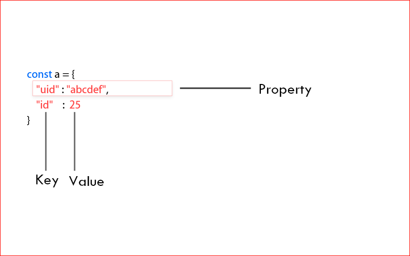
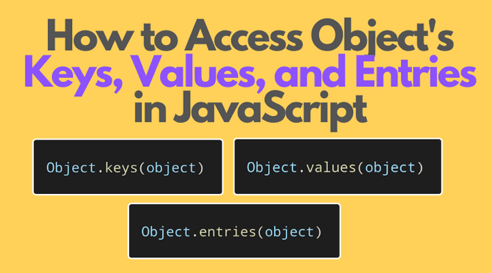
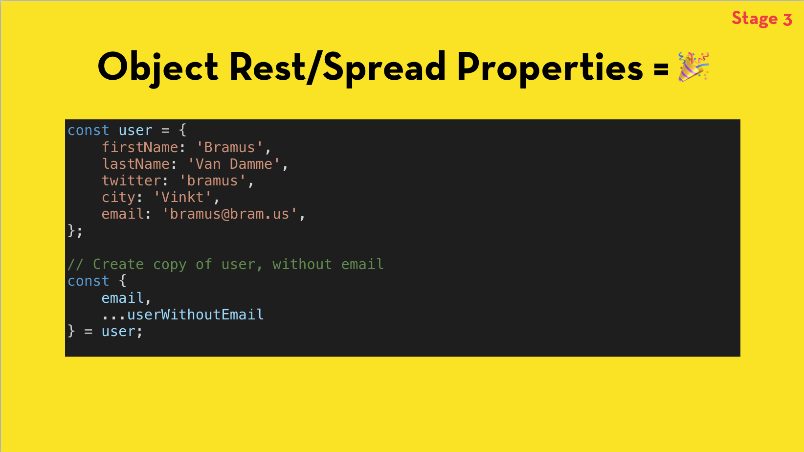
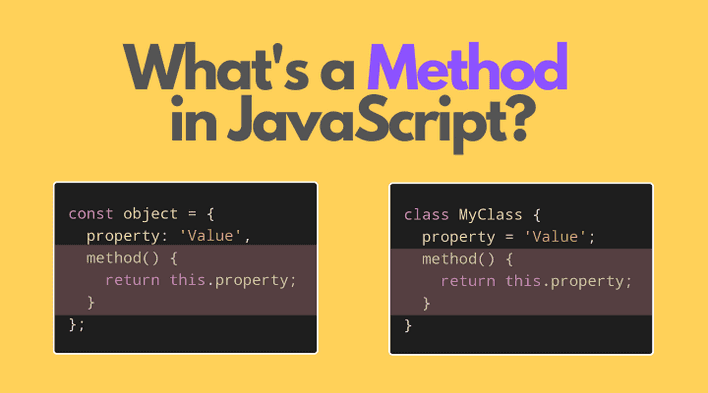
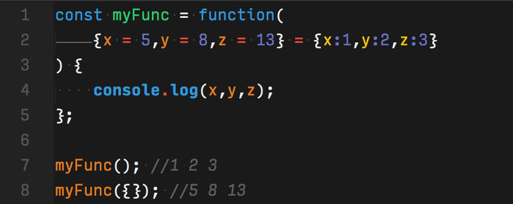
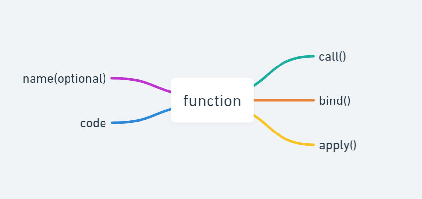

# Table of Contents
- ### Object
- ### Object methods
- ### Destructuring and spread
- ### this

# Object
### JavaScript object is a nonprimitive data-type that allows
### you to store multiple collections of data.

# Object METHODS :
### 1. The Object.enteries() method returns an array of a given object's own enumerable string-keyed property [key,value] pairs.
### 2. The Object.keys() method returns an array of a given object's own enumerable property names, iterated in the same order that a normal loop would.
### 3. The Object.values() method returns an array of a given object's own enumerable property values.

# Destructuring and spread – Destructuring
### The destructuring assignment syntax is a JavaScript expression that makes it possible to unpack properties from object, into distinct variables.

# Destructuring and spread – spread
### 1. The spread operator ... is used to expand or spread an to make it works with own enumerable properties of an object. 
### 2. You can use the spread operator to clone the own enumerable properties of an object.

# This
### 1. The behavior of the this keyword in JavaScript is somewhat different from its comparison with religious languages. There are also differences in collection in strict and nonstrict mode.
## !!! this is not a variable. It is a keyword. You cannot change the value of this !!!

### 2. In JavaScript, the this keyword refers to an object.
### 3. Which object depends on how this is being invoked (used or called).
### 4. The this keyword refers to different objects depending on how it is used:
- #### In an object method, this refers to the object.
- #### Alone, this refers to the global object.
- #### In a function, this refers to the global object.
- #### In a function, in strict mode, this is undefined.
- #### In an event, this refers to the element that received the event.
- #### Methods like call(), apply(), and bind() can refer this to any object.

# this Precedence
### To determine which object this refers to; Use the following precedence of order

# Explicit Function Binding
#### The call() and apply() methods are predefined JavaScript methods.
#### They can both be used to call an object method with another object as argument

# this in a Method
#### When used in an object method, this refers to the object.
#### In the example on top of this page, this refers to the person object.
#### Because the fullName method is a method of the person object.

# this Alone
#### When used alone, this refers to the global object.
#### Because this is running in the global scope.
#### In a browser window the global object is [object Window]:

# this in a Function (Default)
#### In a function, the global object is the default binding for this.
#### In a browser window the global object is [object Window]:

# bind()
#### With the bind() method, an object can borrow a method from another object.

# apply()
#### The apply() method calls the specified function with a given this value, and arguments provided as an array

# call()
#### The call() method calls the function with a given this value and arguments provided individually.

